# 📚 Laravel E-Learning & CBT Platform

[](https://laravel.com)
[](https://livewire.laravel.com)
[](LICENSE)

> 🇮🇩 [Baca dalam Bahasa Indonesia](README.id.md)

A full-featured web-based **E-Learning** and **Computer Based Test (CBT)** platform for managing learning activities between **Admin**, **Teacher**, and **Student**. Built with Laravel 12, Livewire 3, and Laravel Reverb for real-time features.

---

## ✨ Key Features

### 👨‍💼 Admin Panel (`/admin`)
| Feature | Description |
|---------|-------------|
| **Dashboard** | Statistics overview: total teachers, students, classes, subjects |
| **Teachers** | Full CRUD with automatic login account creation |
| **Students** | CRUD + class filtering + **📥 Excel Import** |
| **Classes** | CRUD + homeroom teacher assignment + student count |
| **Subjects** | CRUD + subject code + teacher assignment |
| **Announcements** | CRUD + target audience (all/teacher/student) + publish toggle |
| **Impersonate** | Login as another user for debugging |
| **Security** | Block users & IP addresses |

### 👨‍🏫 Teacher Panel (`/teacher`)
| Feature | Description |
|---------|-------------|
| **Dashboard** | Teaching stats + upcoming exams + active assignments |
| **Materials** | CRUD + file upload + 5 types (document/video/text/link/audio) + view tracking |
| **Assignments** | CRUD + deadline + status management + submission review |
| **CBT Exams** | CRUD + duration + passing grade (KKM) + randomize questions/options + retry |
| **Question Bank** | CRUD + multiple choice (A-E) / fill-in / essay + difficulty levels |
| **Exam Monitor** | Real-time student progress monitoring (auto-refresh every 5s) |
| **Print** | Exam cards, attendance sheets, official reports |
| **💬 Discussion** | Real-time chat with students per assignment (Laravel Reverb) |

### 👨‍🎓 Student Panel (`/student`) — Mobile-First Design
| Feature | Description |
|---------|-------------|
| **Home** | Upcoming exams, active assignments, announcements |
| **Materials** | Browse & download learning materials |
| **Assignments** | View assignments + submit files |
| **Exams** | Exam schedule + score history |
| **Grades** | Average per subject, progress bars, pass/fail status |
| **💬 Discussion** | Real-time chat with teachers per assignment (Laravel Reverb) |

### 🖥️ CBT Exam System
```
Exam Page → Confirmation → Exam Mode
                            ├── ⏱️ Timer Countdown (auto-submit on expiry)
                            ├── 🔒 Anti-Cheat (fullscreen + tab detection)
                            ├── 📍 Question Navigation (color-coded badges)
                            ├── 💾 Auto-Save (on every answer click)
                            └── ✅ Auto-Scoring (multiple choice)
```

---

## 📸 Screenshots

### 🔐 Login Page
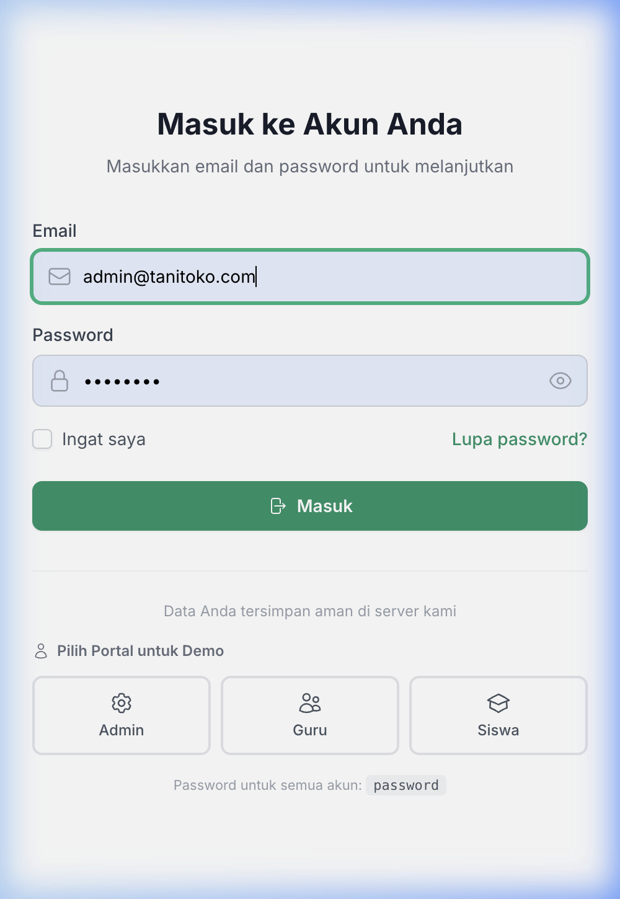

### 👨‍💼 Admin Panel

| Dashboard | Teachers Management |
|:---------:|:-------------------:|
| 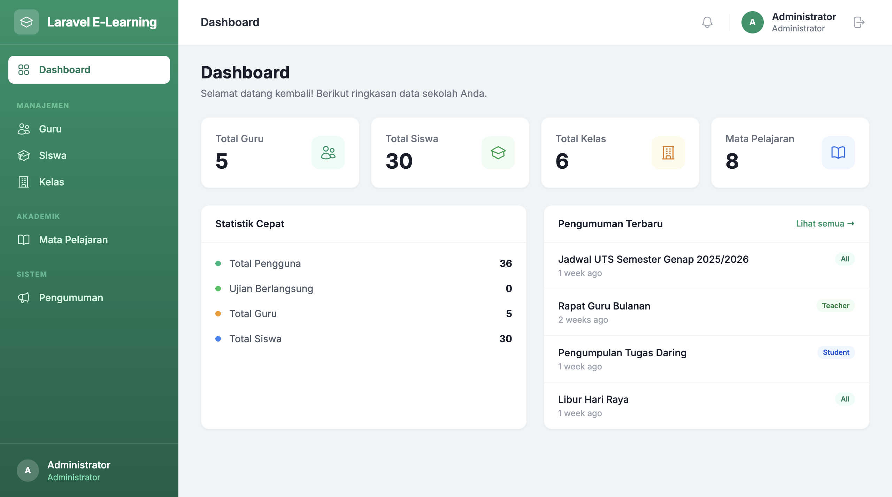 | 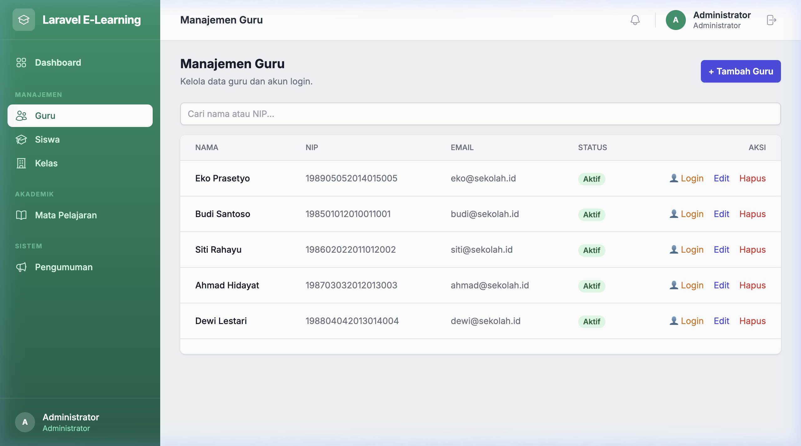 |

| Students Management | Classrooms Management |
|:-------------------:|:---------------------:|
| 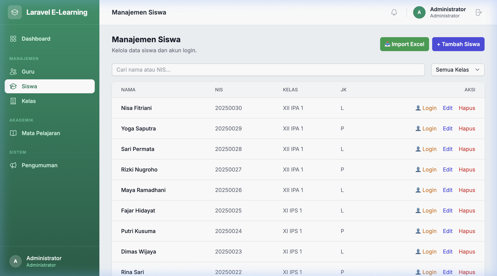 | 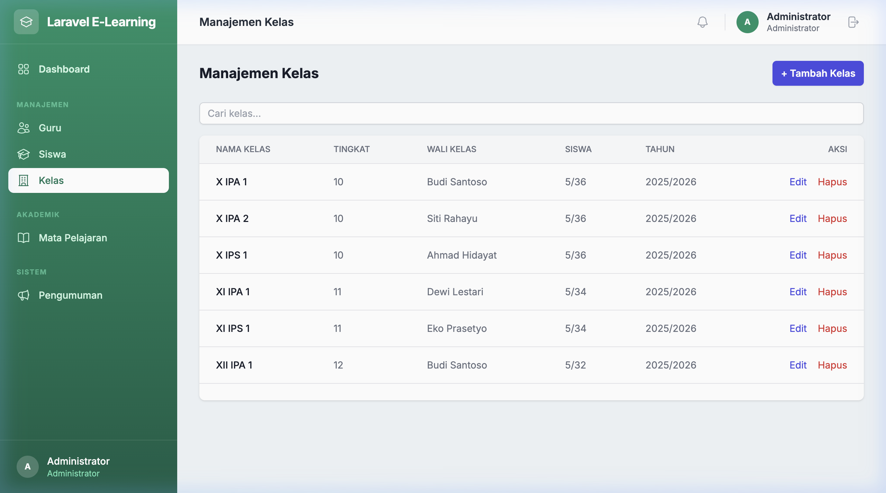 |

| Subjects Management | Announcements |
|:-------------------:|:-------------:|
| 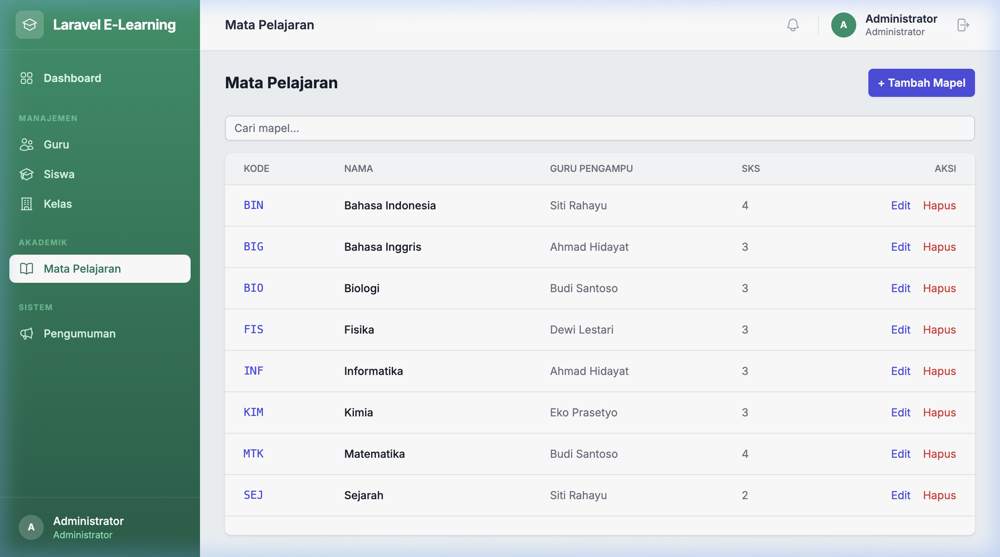 | 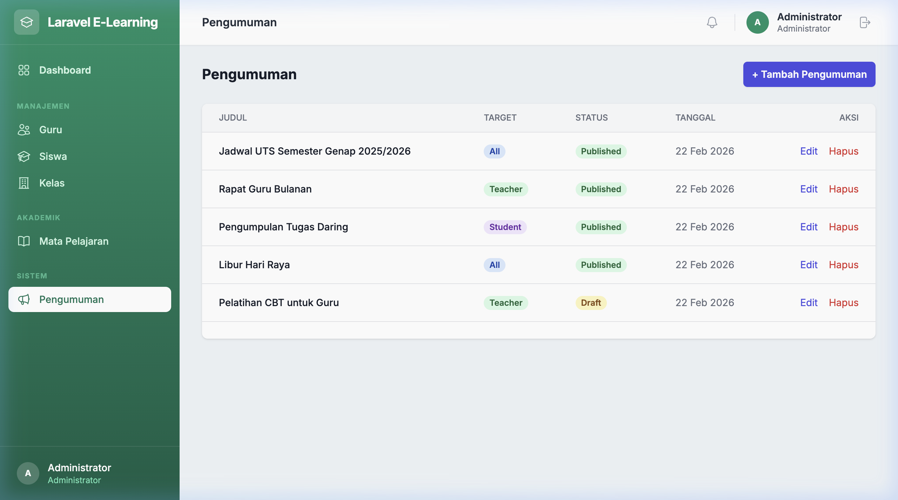 |

### 👨‍🏫 Teacher Panel

| Dashboard | Materials |
|:---------:|:---------:|
| 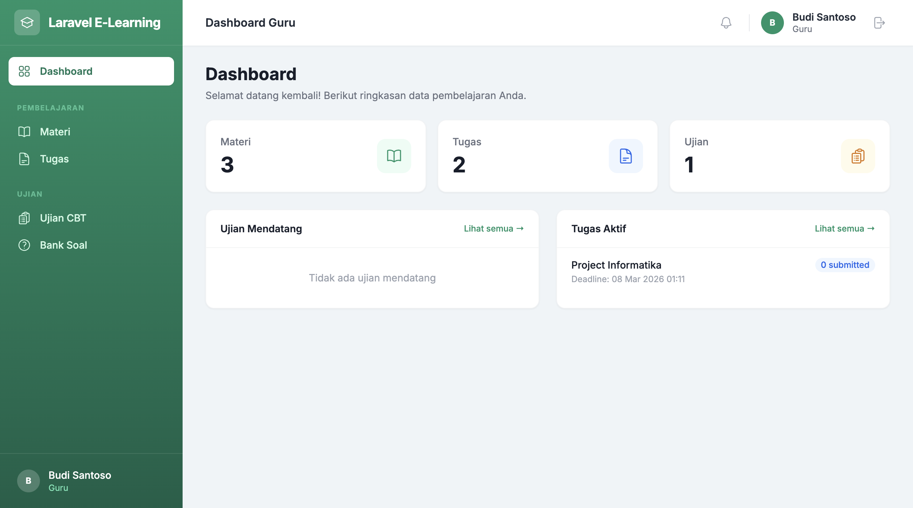 | 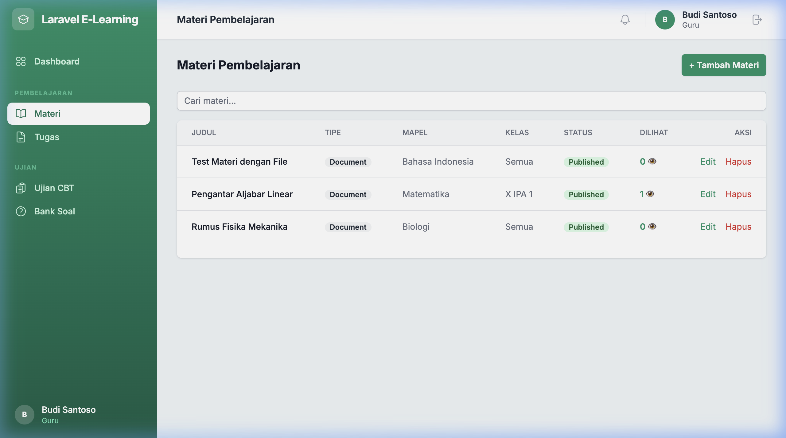 |

| Assignments | CBT Exams |
|:-----------:|:---------:|
| 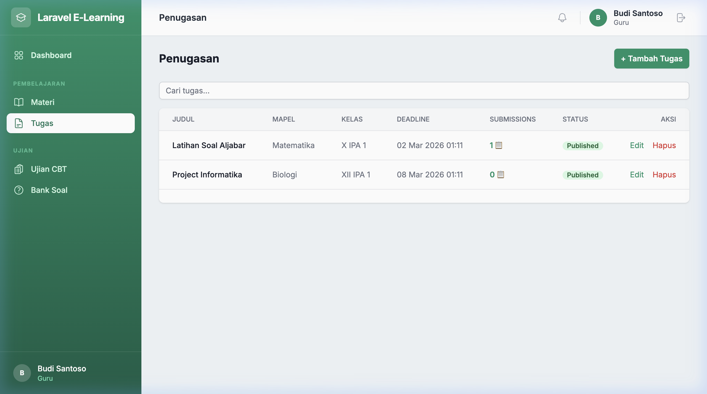 | 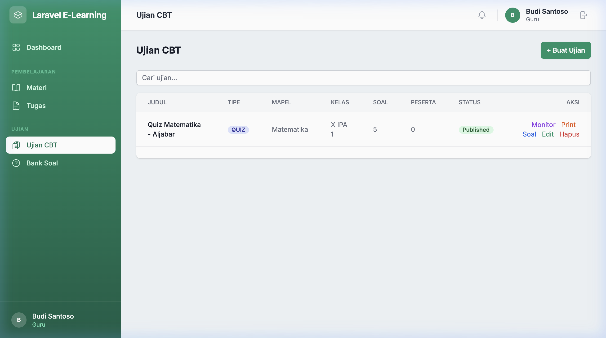 |

| Question Bank |
|:-------------:|
| 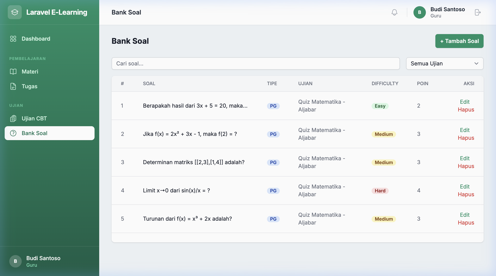 |

### 👨‍🎓 Student Panel (Mobile-First)

| Dashboard | Materials | Assignments |
|:---------:|:---------:|:-----------:|
| 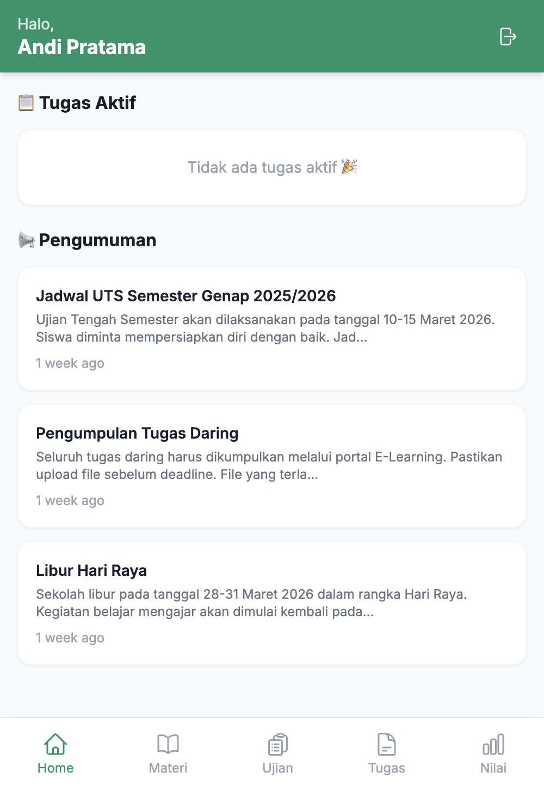 | 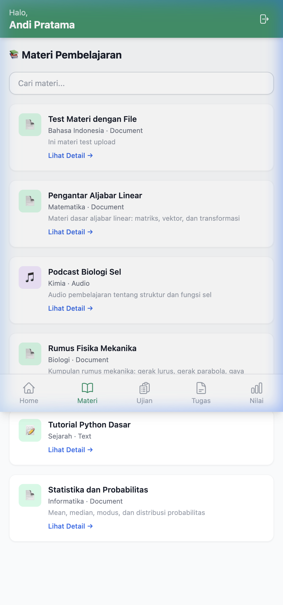 | 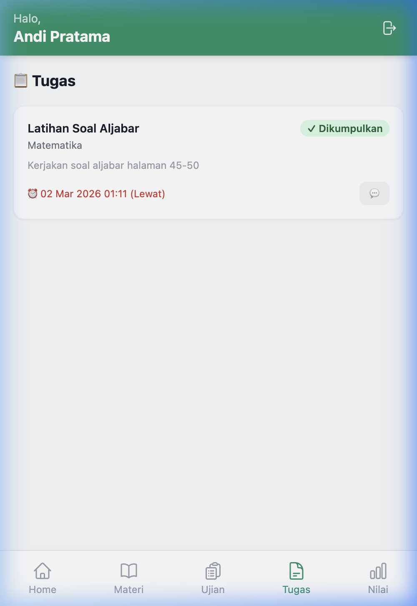 |

| Exams | Grades |
|:-----:|:------:|
| 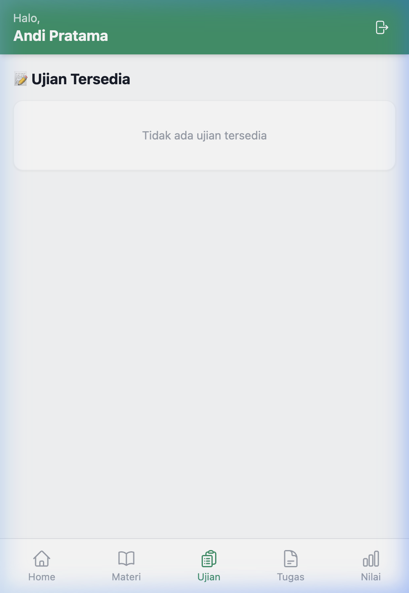 | 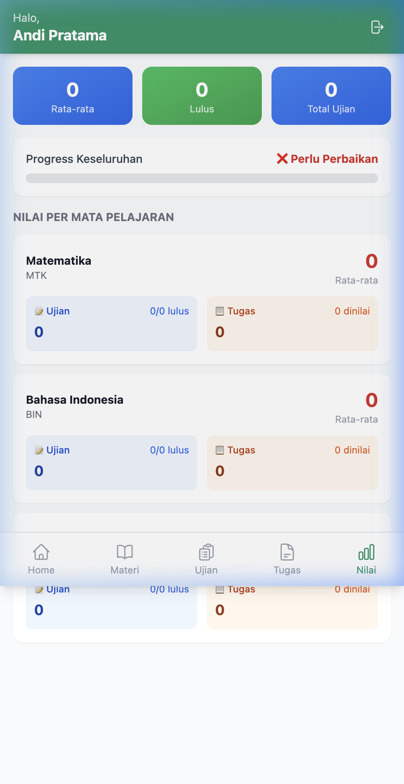 |

---

## 🛠️ Tech Stack

| Layer | Technology |
|-------|------------|
| **Backend** | PHP 8.2+, Laravel 12 |
| **Frontend** | Livewire 3, Volt, Alpine.js, Tailwind CSS 3 |
| **Real-time** | Laravel Reverb (WebSocket) |
| **Database** | MySQL / SQLite |
| **Auth** | Laravel Breeze |
| **Roles** | Spatie Laravel Permission |
| **Excel** | Maatwebsite Excel |
| **Build** | Vite 7 |

---

## 🏗️ Real-time Chat Architecture (Laravel Reverb)

The assignment discussion feature uses **WebSocket** for real-time communication between teachers and students.

### Message Flow

```
┌─────────────┐     ┌──────────────┐     ┌──────────────┐     ┌─────────────┐
│  User sends  │────▶│   Livewire   │────▶│   Database   │     │             │
│   message    │     │   send()     │     │   (MySQL)    │     │   Laravel   │
└─────────────┘     └──────┬───────┘     └──────────────┘     │   Reverb    │
                           │                                   │  (WebSocket │
                           │  broadcast(DiscussionMessageSent) │   Server)   │
                           └──────────────────────────────────▶│             │
                                                               └──────┬──────┘
                                                                      │
                                              WebSocket push (instant) │
                                                                      ▼
                                                        ┌─────────────────────┐
                                                        │  All other users    │
                                                        │  on discussion page │
                                                        │  → auto refresh     │
                                                        └─────────────────────┘
```

### Key Components

| File | Purpose |
|------|---------|
| `app/Events/DiscussionMessageSent.php` | Broadcast event when message is sent |
| `app/Events/DiscussionMessageDeleted.php` | Broadcast event when teacher deletes a message |
| `routes/channels.php` | Private channel authorization per assignment |
| `app/Livewire/Student/AssignmentDiscussionStudent.php` | Student component + Echo listener |
| `app/Livewire/Teacher/AssignmentDiscussionTeacher.php` | Teacher component + Echo listener |
| `resources/js/bootstrap.js` | Laravel Echo + Reverb client setup |

### Channel Authorization

Each assignment discussion uses a **private channel**: `assignment.{assignmentId}.discussion`

Only authorized users can subscribe:
- **Teachers** — any authenticated teacher
- **Students** — students enrolled in the assignment's class

---

## 🚀 Installation

### Prerequisites
- PHP 8.2+
- Composer
- Node.js 18+
- MySQL (or SQLite for development)

### Quick Setup

```bash
# Clone the repository
git clone <repo-url>
cd laravel-elearning

# One-command setup (install deps, generate key, migrate, build assets)
composer setup
```

### Manual Setup

```bash
# Install PHP dependencies
composer install

# Copy environment file & generate app key
cp .env.example .env
php artisan key:generate

# Configure database in .env
# DB_CONNECTION=mysql
# DB_HOST=127.0.0.1
# DB_PORT=3306
# DB_DATABASE=elearning_cbt
# DB_USERNAME=root
# DB_PASSWORD=

# Run migrations (with seed data for demo)
php artisan migrate:fresh --seed

# Install & build frontend
npm install
npm run build
```

### Development Server

```bash
composer dev
```

This runs **5 processes** concurrently:

| Process | Color | Description |
|---------|-------|-------------|
| `php artisan serve` | 🔵 Blue | HTTP server |
| `php artisan queue:listen` | 🟣 Purple | Queue worker |
| `php artisan pail` | 🔴 Red | Log viewer |
| `npm run dev` | 🟠 Orange | Vite dev server |
| `php artisan reverb:start` | 🟢 Green | WebSocket server |

---

## 🔑 Demo Accounts

After running `migrate:fresh --seed`:

| Role | Email | Password | URL |
|------|-------|----------|-----|
| Admin | `admin@sekolah.id` | `password` | `/admin` |
| Teacher | `budi@sekolah.id` | `password` | `/teacher` |
| Teacher | `siti@sekolah.id` | `password` | `/teacher` |
| Student | `andi.pratama1@siswa.id` | `password` | `/student` |

---

## 📥 Student Excel Import Format

| Column | Required | Example |
|--------|----------|---------|
| nama | ✅ | Andi Pratama |
| email | ✅ | andi@siswa.id |
| nis | ✅ | 20250001 |
| kelas | ✅ | X IPA 1 |
| nisn | | 0012345678 |
| gender | | L / P |
| tanggal_lahir | | 2009-05-15 |
| alamat | | Jl. Merdeka No. 1 |
| password | | *(default: password)* |

---

## 🧪 Testing

```bash
composer test
```

---

## 📂 Project Structure

```
app/
├── Events/                    # Broadcast events (Reverb)
├── Imports/
│   └── StudentImport.php      # Excel student import
├── Http/
│   ├── Controllers/           # Impersonate, etc.
│   └── Middleware/             # Role, BlockedUser, BlockedIp
├── Livewire/
│   ├── Admin/                 # 6 components (Dashboard, CRUD teachers/students/classes/subjects/announcements)
│   ├── Student/               # 8 components (Dashboard, materials, assignments, exams, grades, discussion)
│   └── Teacher/               # 11 components (Dashboard, materials, assignments, exams, question bank, monitor, discussion)
├── Models/                    # 17 models (User, Assignment, Exam, etc.)
routes/
├── admin.php                  # Admin routes
├── teacher.php                # Teacher routes
├── student.php                # Student routes
├── channels.php               # Broadcast channel authorization
docs/
└── REVERB-PRODUCTION.md       # Production deployment guide for Reverb
```

---

## 🚢 Production Deployment

See [docs/REVERB-PRODUCTION.md](docs/REVERB-PRODUCTION.md) for the full production deployment guide including Supervisor and Nginx configuration.

---

## 📄 License

This project is open-sourced software licensed under the [MIT license](https://opensource.org/licenses/MIT).
