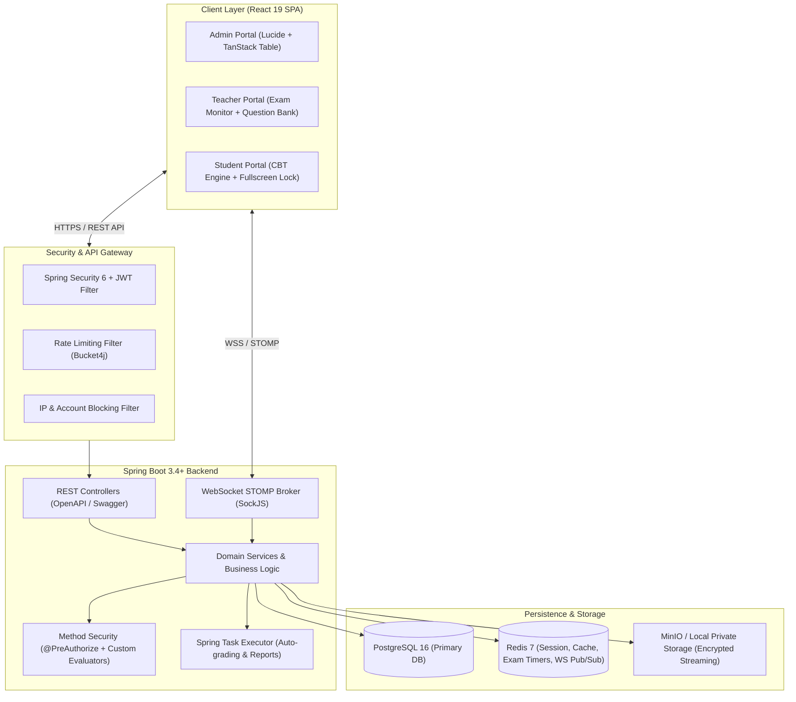
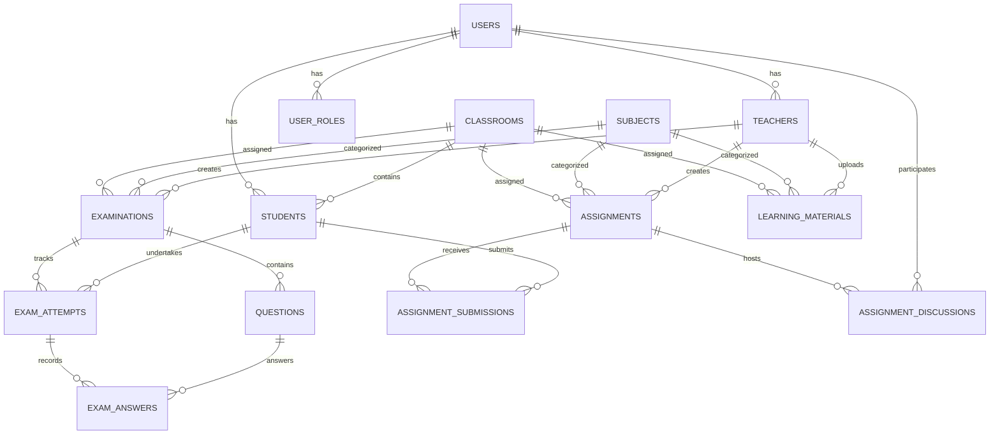
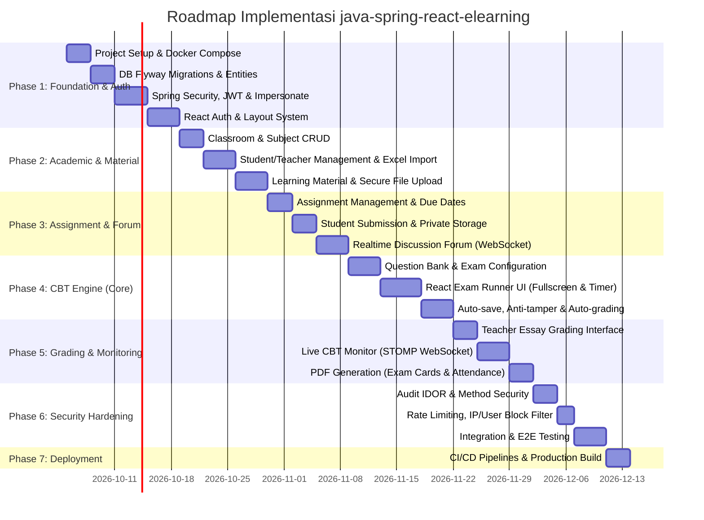

# Implementation Plan: `java-spring-react-elearning`

Enterprise-grade Implementation Plan untuk membangun kembali Learning Management System & CBT (*Computer Based Testing*) dari arsitektur Laravel Livewire menjadi arsitektur modern terpisah: **Java 21 + Spring Boot 3.4+ (Backend)** dan **React 19 + TypeScript + Vite + Tailwind CSS (Frontend)**.

---

## 1. System Architecture Overview



---

## 2. Tech Stack Selection & Justification

| Layer | Technology | Justification |
| :--- | :--- | :--- |
| **Language & Runtime** | Java 21 LTS | Virtual Threads (Project Loom) untuk konkurensi tinggi pengerjaan CBT bersamaan |
| **Backend Framework** | Spring Boot 3.4+ | Framework enterprise standar dengan ekosistem terlengkap dan performa tinggi |
| **Security** | Spring Security 6 + JJWT | Stateless JWT + Refresh Token Rotation, Method Security (`@PreAuthorize`) |
| **Database** | PostgreSQL 16 | Relational integrity ketat, JSONB support untuk format opsi soal CBT |
| **Caching & Realtime** | Redis 7 + Redisson | Distributed locks, CBT countdown timers, dan WebSocket message relay |
| **Realtime Messaging**| Spring WebSocket + STOMP | Realtime CBT monitor, violation tracking, dan live forum diskusi |
| **Object Storage** | MinIO / S3 API | Isolasi berkas submission siswa (non-public disk dengan presigned/streamed access) |
| **Frontend Framework**| React 19 + TypeScript | Type-safe, reaktif, modular component system |
| **Build Tool** | Vite 6 | Fast HMR, optimized production build splitting |
| **UI Design System** | Tailwind CSS v4 + Shadcn UI | Design modern, responsif, dark mode, dan glassmorphism premium |
| **State & Data Fetch**| TanStack Query v5 + Zustand | Server state caching cerdas + lightweight client state management |
| **Forms & Validation**| React Hook Form + Zod | Schema-driven client-side validation sinkron dengan backend DTO |

---

## 3. Database Schema & ERD Architecture



### Key Schema Entities:
1. **`users` & `roles`**: RBAC (`ROLE_ADMIN`, `ROLE_TEACHER`, `ROLE_STUDENT`). Mendukung status aktif dan audit log.
2. **`teachers` & `students`**: Profil terhubung ke `user_id`, NIP/NIS unik, relasi kelas (`classroom_id`).
3. **`examinations`**: Model ujian (CBT) dengan parameter waktu (`start_at`, `end_at`, `duration_minutes`), passing score, flag acak (`shuffle_questions`, `shuffle_options`), retry setting.
4. **`questions`**: Tipe soal (`MULTIPLE_CHOICE`, `ESSAY`, `SHORT_ANSWER`), opsi dalam JSONB, bobot poin, kunci jawaban (`correct_answer` hanya bisa diakses guru).
5. **`exam_attempts` & `exam_answers`**: Status attempt (`IN_PROGRESS`, `NEEDS_GRADING`, `COMPLETED`, `FORCE_FINISHED`), pelanggaran (*violations counter*), skor total, feedback essay.
6. **`assignments` & `submissions`**: Pengumpulan berkas privat, batas waktu (*late submission tolerance*), grading, feedback.
7. **`learning_materials` & `material_views`**: Berkas modul (PDF/Video/Link), status published, tracking waktu baca siswa.
8. **`blocked_ips` & `blocked_users`**: Tabel keamanan untuk mitigasi serangan brute-force dan penangguhan akses.

---

## 4. API & Security Architecture (Defense-in-Depth)

### A. Stateless Authentication & Impersonation
- **JWT Architecture**: Access Token (15 menit) + Refresh Token (7 hari di HttpOnly Cookie dengan rotation).
- **Secure Impersonation**: Endpoint `POST /api/v1/admin/impersonate/{userId}` menerbitkan token sementara (*impersonation scope*) dengan klaim `impersonator_admin_id`. Endpoint `POST /api/v1/admin/stop-impersonate` mengembalikan konteks admin. Mencegah eskalasi hak akses antar-admin.

### B. Otorisasi Objek (Pencegahan IDOR)
Setiap mutasi dan pengambilan objek dilindungi pada layer Service menggunakan Spring Security SpEL Custom Expression:
```java
// Contoh Otorisasi Akses Ujian
@PreAuthorize("hasRole('ADMIN') or @examSecurity.isExamOwner(#examId, authentication)")
public ExamDetailResponse getExamDetail(Long examId) { ... }

// Contoh Otorisasi Pengerjaan Ujian Siswa
@PreAuthorize("hasRole('STUDENT') and @examSecurity.canStudentTakeExam(#examId, authentication)")
public ExamStartResponse startExam(Long examId) { ... }
```

### C. Proteksi Integritas CBT Engine
1. **Server-Side Deadline Enforcement**: Timer di browser siswa hanya berupa representasi visual. Backend menghitung deadline aktual `min(started_at + duration, examination.end_at)` dan menolak jawaban yang dikirim lewat waktu toleransi (+5 detik network latency buffer).
2. **Question Ownership Isolation**: Endpoint `POST /api/v1/student/exams/{examId}/answers` memverifikasi secara langsung bahwa `questionId` memang terikat pada `examId` dan `attempt` berstatus `IN_PROGRESS`.
3. **Hidden Answer Keys**: DTO `StudentQuestionResponse` mengecualikan properti `correctAnswer` dan `explanation`. Guru menggunakan `TeacherQuestionResponse`.
4. **Violation Counter**: Event fullscreen exit dan blur/tab switch dikirim melalui throttling controller dan WebSocket untuk monitoring guru secara realtime.

---

## 5. Project Repository Structure

```text
java-spring-react-elearning/
├── backend/                             # Spring Boot 3.4+ Application
│   ├── src/main/java/com/elearning/
│   │   ├── common/                      # Exceptions, Base Entity, Utils, Constants
│   │   ├── config/                      # SecurityConfig, WebSocketConfig, RedisConfig
│   │   ├── security/                    # JwtProvider, CustomUserDetailsService, Evaluators
│   │   └── modules/
│   │       ├── auth/                    # AuthController, DTOs, AuthService
│   │       ├── academic/                # Classroom & Subject Management
│   │       ├── material/                # Learning Materials & View Tracking
│   │       ├── assignment/              # Assignment, Submissions, Discussions
│   │       ├── exam/                    # CBT Engine, Question Bank, Grading
│   │       ├── monitoring/              # Realtime WebSocket STOMP Handlers
│   │       └── admin/                   # User Management, Impersonate, Excel Import
│   ├── src/main/resources/
│   │   ├── db/migration/                # Flyway SQL Migration Scripts (V1__init.sql, etc.)
│   │   └── application.yml              # Profiles: dev, prod, test
│   └── pom.xml                          # Maven Dependencies
│
├── frontend/                            # React 19 + Vite Application
│   ├── src/
│   │   ├── assets/                      # Icons, Static Images
│   │   ├── components/
│   │   │   ├── ui/                      # Shadcn UI Base Components (Button, Dialog, etc.)
│   │   │   └── common/                  # Navbar, Sidebar, ProtectedRoute, PageHeader
│   │   ├── hooks/                       # useAuth, useCbtTimer, useWebSocket, useViolation
│   │   ├── layouts/                     # AdminLayout, TeacherLayout, StudentLayout, ExamLayout
│   │   ├── pages/
│   │   │   ├── auth/                    # Login, Register, ForgotPassword
│   │   │   ├── admin/                   # Teachers, Students, Classrooms, Subjects
│   │   │   ├── teacher/                 # Dashboard, Materials, Assignments, CBT Monitor, Grading
│   │   │   └── student/                 # Dashboard, Materials, Assignments, CBT Exam Runner
│   │   ├── services/                    # Axios API Client & Endpoints
│   │   ├── stores/                      # Zustand Stores (AuthStore, ExamStore)
│   │   └── types/                       # TypeScript Interfaces & API Types
│   ├── index.html
│   ├── package.json
│   ├── vite.config.ts
│   └── tailwind.config.ts
│
├── docker-compose.yml                   # PostgreSQL, Redis, MinIO, Backend, Frontend
└── README.md
```

---

## 6. Phased Implementation Roadmap



---

## 7. Migration Mapping: Laravel to Spring Boot & React

| Feature | Implementasi di Laravel Elearning | Implementasi Baru di `java-spring-react-elearning` |
| :--- | :--- | :--- |
| **Routing & Auth** | Laravel Session + Breeze + Spatie Roles | Spring Security 6 Stateless JWT + Refresh Token Rotation + React Protected Routes |
| **Component Logic** | Livewire 3 Components (`wire:click`, Livewire state) | Spring Boot REST API Controller + React 19 Client UI with TanStack Query |
| **Realtime Updates** | Laravel Reverb / Pusher + Laravel Echo | Spring WebSocket STOMP + SockJS + `@stomp/stompjs` client |
| **Authorization** | Laravel Policies (`$this->authorize(...)`) | Spring `@PreAuthorize("@policyEvaluator.canAccess(...)")` |
| **Exam Engine UI** | Livewire Blade + Alpine.js `examEngine` | Dedicated React Exam Runner with Zustand, Web Audio, and Fullscreen API |
| **File Submissions** | Local/Public disk symlink | MinIO / S3 Private Bucket with Authorized Streaming / Pre-signed URLs |
| **Bulk Import** | Maatwebsite Excel | Apache POI (Streaming reader `StreamingReader` untuk memory-efficient parsing) |
| **PDF Reporting** | Blade View + Print CSS | OpenHTMLtoPDF / JasperReports REST Endpoint |

---

## 8. Verification & Acceptance Criteria

1. **Security**: Zero IDOR vulnerabilities; automated integration tests verify cross-teacher, cross-student, and cross-classroom access denials (403 Forbidden).
2. **CBT Engine Accuracy**: Otomatisasi penilaian pilihan ganda akurat 100%; batas waktu ujian ditegakkan di sisi server; jawaban siswa tersimpan persisten secara berkala (*heartbeat auto-save*).
3. **Realtime Stability**: WebSocket monitor mampu menangani hingga 1.000 siswa aktif secara bersamaan tanpa degradasi performa pada broker STOMP.
4. **User Experience**: Tampilan antarmuka berstandar premium (*glassmorphism*, dark/light mode, micro-interactions, responsive mobile layout).
